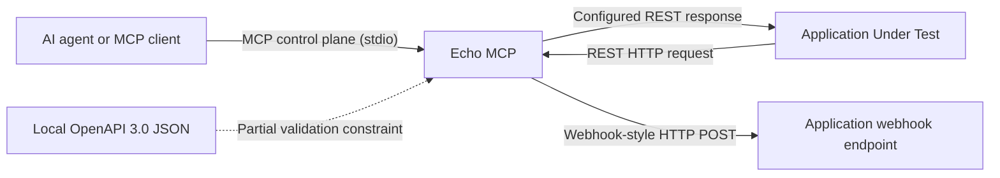

# Echo MCP

Echo MCP is a source-available local simulator for external dependencies in
AI-assisted end-to-end tests.

Modern AI coding assistants can write application code quickly, but end-to-end
tests still depend on external systems that are slow, expensive, rate-limited,
unavailable, or hard to put into the exact failure state a test needs. Echo MCP
gives an AI agent, or any MCP client, a deterministic way to configure external
dependency behavior through MCP while the Application Under Test keeps using
normal REST HTTP and normal webhook endpoints.

## Who Is Echo MCP For?

- AI-assisted software development.
- Teams integrating with external REST APIs.
- Developers who want deterministic end-to-end tests.
- Engineers validating failure handling before external systems exist.
- Test harnesses that need controlled external dependency behavior without
  changing application code.

## Who Is Echo MCP Not For?

- Production API gateway.
- Reverse proxy.
- Public webhook relay.
- General-purpose service virtualization platform.
- Built-in simulator for Stripe, GitHub, Slack, or any other public API.
- Hosted service for untrusted users or public internet traffic.

## The Solution

Echo MCP has two planes:

- **Control Plane:** MCP over stdio for AI agents and other MCP clients.
- **Data Plane:** normal REST HTTP and webhook-style HTTP delivery for the
  Application Under Test.

The MCP client sends complete concrete behavior to Echo MCP. Echo MCP stores
accepted behavior in memory and executes it deterministically when the
application sends a matching request.

Echo MCP v0.3.0 can load one local OpenAPI 3.0 JSON contract at runtime through
MCP, or at startup through `ECHO_MCP_OPENAPI_FILE`. The contract is a validation
constraint only. Echo MCP does not fetch, generate, repair, or complete OpenAPI
specs, and it does not generate behavior from OpenAPI.

Validation is partial. Strict mode means strict enforcement of the validation
capabilities currently supported by Echo MCP; it is not full OpenAPI validation.

## Core Philosophy

- AI decides the test scenario.
- The MCP client sends concrete behavior.
- Echo MCP validates behavior when constraints are available.
- Echo MCP executes accepted behavior deterministically.
- Applications remain production-like.
- The Control Plane stays separate from the Data Plane.

## Architecture



The application must not contain MCP awareness, Echo MCP-specific branches,
simulator headers, or observation reads.

## Features

Current implemented capabilities:

- MCP control plane over stdio.
- `configure_behavior` for one in-memory REST response rule.
- Runtime OpenAPI contract tools: `load_openapi_contract`,
  `get_contract_status`, and `unload_openapi_contract`.
- Partial contract-backed response validation for supported OpenAPI 3.0 JSON
  features.
- Local internal `$ref` resolution for response schemas.
- Validation capability disclosure through `validation_scope`,
  `validation_capabilities`, and `validation_mode_description`.
- Contract root boundary with `ECHO_MCP_CONTRACT_ROOT`.
- Safe contract source path display relative to the contract root.
- MCP initialize instructions with concise agent guidance.
- Workflow-aware tool descriptions and tool annotations for MCP clients.
- Guidance prompts and resources for manual mock, hybrid validation, and
  contract-backed workflows.
- REST data plane on `:8080` by default, configurable with
  `ECHO_MCP_HTTP_ADDR`.
- Configured HTTP status, response body, and optional response content type.
- HTTP `501 Not Implemented` for unmatched REST requests, which indicates
  missing simulator setup rather than a simulated provider response.
- `get_observations` for received requests, matched behavior, match criteria,
  produced outcomes, and webhook delivery attempts.
- `reset` for clearing configured behavior and observations while keeping an
  active OpenAPI contract loaded.
- Startup OpenAPI loading with `ECHO_MCP_OPENAPI_FILE`, using the same contract
  manager and contract-root boundary as runtime loading.
- `send_webhook_event` for one immediate HTTP `POST` to one configured
  application webhook endpoint.
- Local Go binary, Dockerfile, and `make` commands for local development.

Current limits:

- One Echo MCP process represents one simulated external dependency.
- One process supports one OpenAPI contract, one registered webhook endpoint,
  and one active REST behavior rule.
- Multiple external dependencies require multiple Echo MCP processes with
  separate `ECHO_MCP_HTTP_ADDR` values and MCP server registrations.
- OpenAPI validation is partial response validation for supported OpenAPI 3.0
  JSON features only.
- Supported response schema features include object and primitive schemas,
  required properties, enum, nullable, local internal `$ref`, nested local refs,
  arrays of supported item schemas, and omitted or boolean
  `additionalProperties`.
- No UI, CLI, authentication, authorization, persistence, admin API, metrics,
  audit log, recording, replay, SaaS, or production deployment architecture.
- No `echo-mcp.yaml` project manifest.
- No full OpenAPI-first runtime.
- No OpenAPI 3.1, YAML, remote refs, file refs, `allOf`, `oneOf`, `anyOf`,
  discriminator support, request body validation, query/header/path parameter
  validation, automatic scenario generation, built-in public API contracts, or
  provider-specific simulators.
- No webhook retries, scheduling, signatures, delivery persistence, AsyncAPI,
  event bus, or inbound public webhook receiver.

## Runtime Contract Workflow

Recommended contract-backed workflow:

1. Start Echo MCP.
2. Call `load_openapi_contract` with a local OpenAPI 3.0 JSON file.
3. Call `get_contract_status` and inspect `validation_scope`,
   `validation_capabilities`, and `validation_mode_description`.
4. Call `configure_behavior` with a concrete response.
5. Let Echo MCP validate the configured response against supported contract
   capabilities.
6. Run app tests against the REST data plane.
7. Use `reset` between scenarios; the contract remains active.
8. Use `unload_openapi_contract` when switching contract contexts.

Manual mock behavior remains supported. When no contract is active,
`configure_behavior` works as a manual mock exactly as before. When a contract
is active, validation can be intentionally skipped for fault tests by passing
`validation.mode = "off"` with a non-empty `reason`.

## Choosing The Right Echo MCP Workflow

Choose the workflow intent before asking an AI agent to build or test an
external API integration.

- `manual_mock`: use for exploration, prototyping, simulating failures, or
  working without an available API contract. Manual mocks remain useful, but
  they are not provider-contract validated.
- `hybrid_validation`: use when a contract exists but manual scenarios are
  still useful, validation or reporting is available or planned, or the project
  is migrating from manual mocks.
- `contract_first`: use when external provider fidelity matters, CI should
  catch schema drift, and an official or internal OpenAPI contract is
  available. In v0.3.0, this means partial response validation for supported
  OpenAPI 3.0 JSON features, not full OpenAPI validation.

If you only say "use Echo MCP to mock provider X", an AI agent may choose the
fastest working path: handwritten provider-like types and manual scenario
fixtures. That can be acceptable for `manual_mock` workflows, but it is not the
same as contract-backed validation.

When provider contract fidelity matters, say so explicitly in the first prompt.
See [Best Practices](docs/guides/best-practices.md) for prompt templates.

## Security

Echo MCP is intentionally designed for local development and controlled test
environments.

Do not expose the HTTP data plane or MCP control plane to untrusted networks.
The MVP does not include authentication or authorization. The MCP control plane
can configure simulator behavior, load local contracts under the configured
contract root, and webhook-style event delivery can send outbound HTTP requests
to configured application webhook endpoints. If exposed incorrectly, Echo MCP
could be abused.

Set `ECHO_MCP_CONTRACT_ROOT` to the directory where OpenAPI fixtures are allowed
to live. If it is unset, Echo MCP uses the process working directory as the
contract root. Runtime and startup OpenAPI loading reject paths that resolve
outside the contract root, including traversal and symlink escapes where the
platform can detect them.

Bind or expose Echo MCP to localhost by default where possible. If running
outside a local machine, use firewalling, container/network isolation, or
private CI networking. Do not configure webhook endpoints pointing to arbitrary
third-party systems. Only configure webhook endpoints owned by the
application/test environment.

See [SECURITY.md](SECURITY.md) for release security guidance.

## License

Echo MCP is source-available under the [Elastic License 2.0](LICENSE). It is not
OSI open source.

Echo MCP is free to use for internal development and testing under the license
terms. Commercial or enterprise licensing may be offered separately later.

## Tell Your AI

Using ChatGPT, Codex, Claude, Cursor, or another MCP-capable coding assistant?

Instead of manually wiring every step, tell your AI:

```text
Install Echo MCP and configure it for this project.
```

Then point the AI to
[AI-Assisted Installation](docs/guides/ai-assisted-installation.md). The guide
is written as a deterministic checklist for AI coding assistants.

## Quick Start

Recommended installation path:

1. Download the correct binary archive from
   [Echo MCP v0.3.0](https://github.com/nagorn/echo-mcp/releases/tag/v0.3.0).
2. Download `checksums.txt`.
3. Verify the archive SHA-256 checksum.
4. Extract the `echo-mcp` binary.
5. Register that binary as an MCP stdio server.

Asset mapping:

| Platform | Asset |
| --- | --- |
| macOS Apple Silicon | `echo-mcp_darwin_arm64.tar.gz` |
| macOS Intel | `echo-mcp_darwin_amd64.tar.gz` |
| Linux amd64 | `echo-mcp_linux_amd64.tar.gz` |
| Linux arm64 | `echo-mcp_linux_arm64.tar.gz` |
| Windows amd64 | `echo-mcp_windows_amd64.zip` |

For example, on macOS Apple Silicon:

```bash
mkdir -p .codex/bin
curl -L -o /tmp/echo-mcp_darwin_arm64.tar.gz \
  https://github.com/nagorn/echo-mcp/releases/download/v0.3.0/echo-mcp_darwin_arm64.tar.gz
curl -L -o /tmp/echo-mcp-checksums.txt \
  https://github.com/nagorn/echo-mcp/releases/download/v0.3.0/checksums.txt
(cd /tmp && grep 'echo-mcp_darwin_arm64.tar.gz' echo-mcp-checksums.txt | shasum -a 256 -c -)
tar -xzf /tmp/echo-mcp_darwin_arm64.tar.gz -C .codex/bin
chmod +x .codex/bin/echo-mcp
```

Register Echo MCP as an MCP stdio server in your MCP host. For Codex, use a
server name that is valid as a TOML key, such as `echo_mcp`:

```toml
[mcp_servers.echo_mcp]
command = "/absolute/path/to/project/.codex/bin/echo-mcp"
args = []
env = { ECHO_MCP_HTTP_ADDR = "127.0.0.1:18080", ECHO_MCP_CONTRACT_ROOT = "/absolute/path/to/project/contracts" }
```

Building from source is the fallback path for development, unsupported
platforms, or users who specifically want to inspect or modify the source before
running Echo MCP.

Ask the MCP client to call `configure_behavior`:

```json
{
  "behavior_id": "hello-ok",
  "match": {
    "method": "GET",
    "path": "/hello"
  },
  "outcome": {
    "type": "http_response",
    "status_code": 200,
    "content_type": "application/json",
    "body": "{\"message\":\"hello from Echo MCP\"}"
  }
}
```

Send a normal REST request through the data plane:

```bash
curl -i http://127.0.0.1:18080/hello
```

Expected response:

```http
HTTP/1.1 200 OK
Content-Type: application/json

{"message":"hello from Echo MCP"}
```

Ask the MCP client to call `get_observations`. It should report the received
request, the matched behavior `hello-ok`, the match criteria, and the produced
HTTP outcome.

Call `reset` before the next scenario.

This direct `curl` request is a wiring smoke test. In real end-to-end tests, the
Application Under Test should make the REST request through its normal external
dependency configuration.

## Multiple External Dependencies

MVP usage: one Echo MCP process represents one simulated external dependency.

For an application that talks to several external dependencies, run one Echo MCP
process per dependency and give each process its own `ECHO_MCP_HTTP_ADDR`,
optional `ECHO_MCP_CONTRACT_ROOT`, and MCP server registration.

Example:

```bash
ECHO_MCP_HTTP_ADDR=127.0.0.1:18080 \
ECHO_MCP_CONTRACT_ROOT=./contracts/payments \
./bin/echo-mcp

ECHO_MCP_HTTP_ADDR=127.0.0.1:18081 \
ECHO_MCP_CONTRACT_ROOT=./contracts/fraud \
./bin/echo-mcp
```

Point the application's payment base URL at `http://127.0.0.1:18080` and its
fraud base URL at `http://127.0.0.1:18081`.

Multi-dependency support inside one Echo MCP process is future work and would
require a future design decision.

## Hello World

Start with [Echo MCP Hello World](docs/examples/hello-world.md).

It shows the canonical workflow:

1. Configure one behavior through MCP.
2. Send a normal REST request from the application.
3. Receive the configured HTTP response.
4. Inspect observations through MCP.

If the application calls the REST data plane before a matching behavior is
configured, Echo MCP returns HTTP `501 Not Implemented`. Provider-like responses
are returned only when explicitly configured.

## Real-World Example

See the
[Stripe-like PaymentIntent scenario](docs/examples/stripe-paymentintent-scenario.md)
for a realistic payment-confirmation failure.

The example is manually derived from Stripe's public API shape. Echo MCP is not a
Stripe simulator and does not include Stripe-specific behavior.

## Webhook Example

See
[Webhook-Style Event Delivery](docs/examples/webhook-style-event-delivery.md)
for the current webhook slice.

Webhook endpoint addresses are configured by the developer or test harness with
`ECHO_MCP_WEBHOOK_ENDPOINT_NAME` and `ECHO_MCP_WEBHOOK_ENDPOINT_ADDRESS`. MCP
clients call `send_webhook_event` using `endpoint_name`; they do not provide raw
outbound URLs.

## Documentation

| Area | Document |
| --- | --- |
| Architecture decisions | [ADRs](docs/adr/) |
| Concepts | [Scope](docs/concepts/scope.md), [Terminology](docs/concepts/terminology.md), [Core Abstractions](docs/concepts/core-abstractions.md) |
| Configuration | [Configuration Reference](docs/reference/configuration.md) |
| MCP tools, prompts, and resources | [MCP Tool Reference](docs/reference/mcp-tools.md) |
| Unmatched requests | [Unmatched REST Requests](docs/reference/unmatched-rest-requests.md) |
| Best practices | [Best Practices](docs/guides/best-practices.md) |
| Developer workflow | [Developer Usage Guide](docs/guides/developer-usage.md) |
| AI workflow | [AI Agent Usage Guide](docs/guides/ai-agent-usage.md) |
| Installation | [Installation Guide](docs/guides/installation.md) |
| AI installation | [AI-Assisted Installation](docs/guides/ai-assisted-installation.md) |
| Installation and release | [Installation and Release Guidance](docs/guides/installation-and-release.md) |
| Release notes | [v0.3.0](docs/releases/v0.3.0.md) |
| Examples | [Hello World](docs/examples/hello-world.md), [Stripe-like PaymentIntent](docs/examples/stripe-paymentintent-scenario.md), [Webhook-style Event Delivery](docs/examples/webhook-style-event-delivery.md) |
| Agent instructions | [Copy-pasteable agent template](docs/templates/agent-instructions.md) |

## Roadmap

Current implemented capabilities:

- One in-memory REST response behavior.
- Runtime OpenAPI contract loading through MCP.
- Partial contract-backed response validation for supported OpenAPI 3.0 JSON
  features.
- Configurable REST data-plane listen address with `ECHO_MCP_HTTP_ADDR`.
- Deterministic HTTP `501` response for unmatched REST requests.
- Immediate single-attempt webhook-style event delivery to one configured
  application webhook endpoint.
- In-memory observations and reset.

Current public release:

- `v0.3.0`

Active next work:

- Continue hardening OpenAPI compatibility without claiming full OpenAPI-first
  support.
- Continue documentation and example hardening based on real project usage.

## Contributing

Echo MCP is maintained primarily by the author. Feedback and focused fixes are
welcome, but substantial feature work should start with an issue or design
discussion first.

Before proposing changes, read [CONTRIBUTING.md](CONTRIBUTING.md), run:

```bash
make test
make build
git diff --check
```

---

🛠 **Built on the Workbench**

This repository is one of many small tools from **Nagorn's Lab**.

Every tool here exists because some repeated task became annoying enough to fix.

🏠 https://nagorn.io
